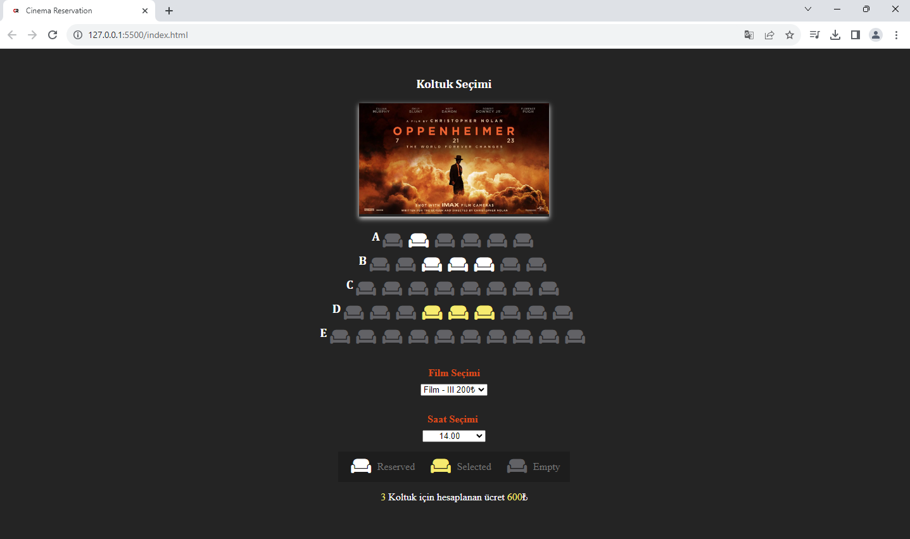

<h1> Sinema Rezervasyon </h1>

Sinema rezervasyon ekranı.
Bu projede koltuk ve saat seçebilirsiniz.
Rezerve, seçili ve boş koltukları görüntüleyebilirsiniz. 
Seçtiğiniz film koltuk(ların) sayısına göre toplam ücret ekrana yansıtılır.

Video;
https://www.linkedin.com/feed/update/urn:li:activity:7108810898965770241/

-------------------------------

Cinema reservation screen.
You can choose the seat and time.
You can view reserved, selected and empty seats.
The total price is displayed on the screen according to the number of movie seat(s) you choose.

Video;
https://www.linkedin.com/feed/update/urn:li:activity:7108810898965770241/

<h2> Kullanılan Teknolojiler </h2>

- Javascript
- HTML 
- CSS kullanıldı.

<h3> Ekran Görüntüleri </h3>

<h5> GIF </h5>

